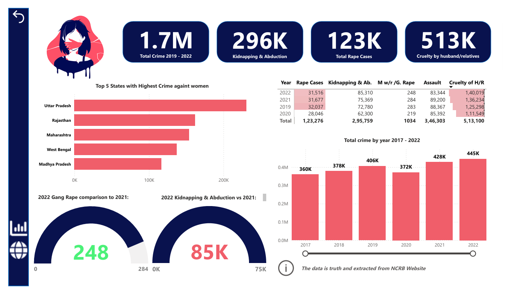
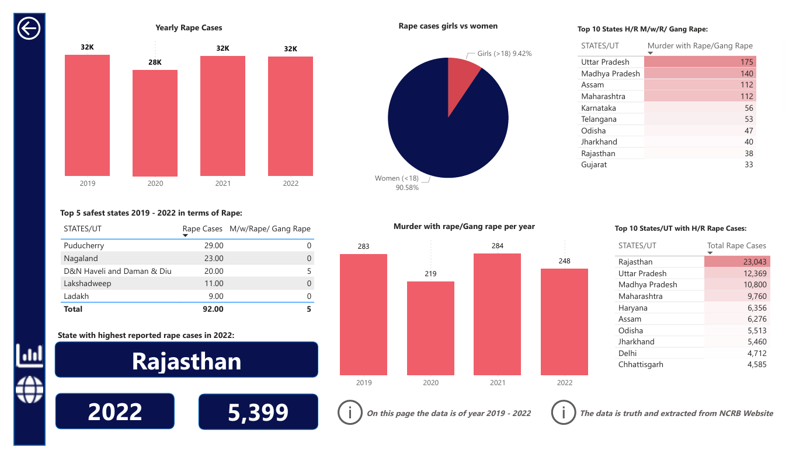

# 📊 Crime Against Women in India (2019-2022)  

This repository showcases a comprehensive analysis of crimes against women in India from **2019 to 2022**. The project focuses on identifying trends in various categories of crimes to provide actionable insights.  

---

## 🔍 **Overview**  
This project analyzes key categories of crimes against women, including:  
- **Rape Cases**  
- **Gang Rapes**  
- **Kidnapping and Abduction**  
- **Assault with Intent to Outrage Modesty**  
- **Cruelty by Husband or Relatives**  

The data was sourced from official **NCRB (National Crime Records Bureau)** PDFs and processed for meaningful analysis.  

---

## 🛠️ **Tools & Technologies**  
- **Power BI**: For creating interactive and visually appealing dashboards.  
- **NCRB Data**: Extracted and processed

## 🔍 Preview  
  
  
*A glimpse of the interactive dashboard showcasing crime trends.*
*Full pbix file is in repository you can check it out.*

